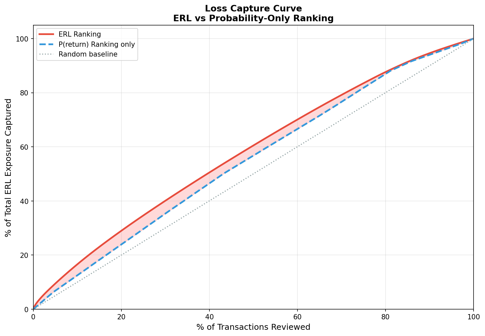
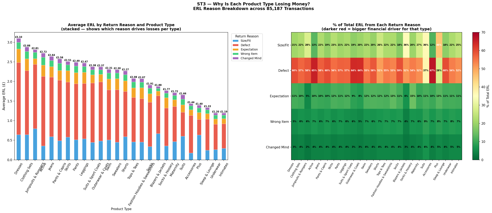
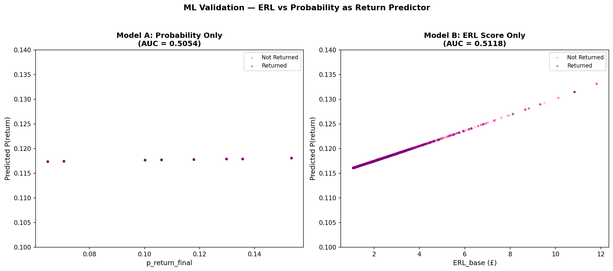

# 🛍️ E-Commerce Return Risk Analytics

### 💰 Expected Return Loss (ERL) framework for financially prioritising e-commerce returns

A transaction-level analytics project that combines **return probability, return reason and financial impact** to identify the transactions creating the greatest expected return-related financial exposure.

Developed as part of an MSc Data Science group project, with my primary contribution focused on the design, implementation and analysis of the **Expected Return Loss (ERL) framework**.

---

## 🎯 Business Problem

E-commerce returns create costs beyond the refunded purchase price, including:

- reverse shipping
- inspection and processing
- restocking
- markdown losses
- disposal or damaged inventory

Traditional return-risk models focus primarily on:

> **How likely is this transaction to be returned?**

However, two transactions with the same return probability can have very different financial consequences.

This project therefore investigates a different question:

> **Which transactions create the greatest expected financial loss if returned?**

To address this, the project introduces **Expected Return Loss (ERL)** — a transaction-level financial risk score combining return likelihood, likely return reason and reason-specific cost.

---

## 🔄 Project Pipeline

The complete project was structured as a four-stage analytics pipeline:

| Stage | Purpose |
|---|---|
| **ST1 — Return Probability** | Estimate the likelihood that a transaction will be returned |
| **ST2 — Return Reason Classification** | Estimate probabilities across five potential return reasons |
| **ST3 — Expected Return Loss** | Combine probability, reason and financial cost into an ERL score |
| **ST4 — Intervention Evaluation** | Evaluate whether return-prevention actions are financially worthwhile |

### ⭐ My Primary Contribution: ST3 — Expected Return Loss

This repository focuses primarily on **ST3**, where I integrated the outputs from ST1 and ST2 and developed the transaction-level financial risk framework.

---

## 🧮 Expected Return Loss Framework

For transaction *i*:

### ERLᵢ = P(returnᵢ) × Σᵣ [P(reasonᵣ | i) × C(reasonᵣ)]

Where:

- **P(returnᵢ)** = estimated probability that transaction *i* is returned
- **P(reasonᵣ | i)** = probability of return reason *r*
- **C(reasonᵣ)** = estimated financial cost associated with that reason

Five return reasons were modelled:

- `size_fit`
- `defect`
- `expectation_mismatch`
- `wrong_item`
- `changed_mind`

Most reason costs use fixed processing estimates.

Defect-related losses additionally depend on transaction value:

```text
Defect Cost = £15 + (20% × Order Value)
```

As a result, a high-value transaction with moderate return probability can receive a higher ERL than a cheaper transaction with a greater probability of being returned.

---

## 📊 Data

The framework was evaluated using **85,187 completed transactions** from Google's synthetic **TheLook e-commerce dataset**.

ST3 receives two processed inputs from the preceding stages:

```text
ST1 → Transaction-level return probability
ST2 → Product-type return-reason probabilities
```

These are integrated with the financial cost assumptions to calculate ERL for every transaction.

Because the underlying transaction data is synthetic, the results should be interpreted as a **proof-of-concept financial risk framework rather than a production retail model**.

---

## ⚙️ ST3 Analytics Pipeline

```text
ST1 Return Probability
          +
ST2 Return Reason Distribution
          │
          ▼
    Data Validation
          │
          ▼
  Financial Cost Matrix
          │
          ▼
Reason-Weighted Expected Cost
          │
          ▼
 Expected Return Loss (ERL)
          │
          ▼
 Transaction Risk Ranking
          │
          ▼
Loss Capture & Risk Tiers
          │
          ▼
     Output for ST4
```

The pipeline validates required fields, probability ranges, positive order values, reason-probability sums and product-type coverage before calculating financial exposure.

---

## 📈 Key Results

The analysis showed that **return probability and financial return risk are not equivalent**.

| Metric | Result |
|---|---:|
| Transactions analysed | **85,187** |
| Transactions moving >1,000 ranking positions | **80,968 (95.0%)** |
| Top 10% exposure captured — ERL | **16.6%** |
| Top 10% exposure captured — Probability only | **12.5%** |
| Gini coefficient — ERL | **0.1601** |
| Gini coefficient — Probability only | **0.1058** |
| Relative Gini improvement | **1.51×** |

### 🔀 95% of Transactions Changed Ranking Substantially

Introducing financial impact caused **80,968 transactions (95.0%)** to move by more than 1,000 positions compared with ranking by return probability alone.

This demonstrates that the transactions most likely to be returned are not necessarily the transactions creating the greatest financial exposure.

---

## 💷 ERL Captures More Financial Exposure



When reviewing the **top 10% of transactions**, ERL-based ranking captured:

### **16.6% of total financial exposure**

compared with:

### **12.5% using return probability alone**

The Gini coefficient also increased from **0.1058 to 0.1601**, representing a **1.51× improvement in financial-risk concentration**.

This suggests that incorporating financial severity provides a more targeted way to prioritise transactions when the business objective is reducing expected return losses.

---

## 🔍 What Drives Return Losses?



Financial exposure was decomposed by return reason and product type.

The analysis showed that **defect-related costs were the dominant financial driver across many product categories**, while size/fit exposure was particularly important for selected categories.

This demonstrates one of the main advantages of ERL: it identifies not only **where financial risk is concentrated**, but also **what is driving that exposure**.

---

## 🚦 Risk Segmentation

Transactions were segmented into five ERL risk tiers:

| Risk Tier | Transactions | Average ERL | Total ERL |
|---|---:|---:|---:|
| 🟢 Low | 42,675 | £1.74 | £74,114.90 |
| 🟡 Medium | 21,528 | £2.28 | £49,060.56 |
| 🟠 High | 12,589 | £2.66 | £33,447.63 |
| 🔴 Very High | 4,250 | £3.14 | £13,340.58 |
| 🚨 Critical | 4,145 | £4.20 | £17,394.31 |

Observed return rates remained relatively similar across these tiers, while **average financial exposure increased substantially**.

This highlights an important distinction:

> **High financial risk does not necessarily mean high return probability.**

A transaction may instead be classified as high risk because the financial consequences of a potential return are substantially greater.

---

## 🧪 Model Validation



The upstream return-probability model had limited discriminatory power, and ERL itself was **not designed as a replacement return classifier**.

Instead, ERL addresses a different business problem:

```text
Return Probability
→ How likely is the transaction to be returned?

Expected Return Loss
→ How much financial exposure does the transaction create?
```

This distinction is important when interpreting the results: the purpose of ERL is **financial prioritisation**, not simply maximising return-classification accuracy.

---

## 👩‍💻 My Contribution

This was a collaborative MSc Data Science project. My primary responsibility was **ST3 — Expected Return Loss Construction**.

My contribution included:

- designing the ST3 methodology
- integrating outputs from ST1 and ST2
- constructing the reason-specific financial cost framework
- implementing transaction-level ERL calculations in Python
- developing data-validation checks
- creating ERL-based transaction rankings
- developing financial risk tiers
- comparing ERL with probability-only ranking
- implementing loss-capture analysis
- calculating and comparing Gini coefficients
- conducting sensitivity analysis
- creating analytical visualisations
- interpreting ST3 results from a commercial perspective
- contributing to the final report, review and editing

---

## 🛠️ Technologies & Skills

### 💻 Programming & Data Analysis

`Python` `Pandas` `NumPy` `Matplotlib` `Jupyter` `Google Colab`

### 📊 Analytics

`Data Cleaning` `Data Validation` `Data Integration`  
`Expected-Loss Modelling` `Risk Scoring` `Cost-Sensitive Analytics`  
`Ranking Analysis` `Sensitivity Analysis` `Gini Analysis`  
`Data Visualisation` `Business Analytics`

---

## 📁 Repository Structure

```text
ecommerce-return-risk-analytics/
│
├── README.md
│
├── notebooks/
│   └── st3_pipeline_colab.ipynb
│
├── images/
│   ├── ERL_loss_capture_curve.png
│   ├── ERL_reason_breakdown.png
│   └── ERL_ml_validation.png
│
├── report/
│   └── report_group_projectERL.pdf
│
├── data/
│   └── README.md
│
└── requirements.txt
```

---

## ▶️ How to Run

ST3 expects the processed outputs generated by the preceding stages:

```text
output_p_return.csv
table10_p_reason_product_type.csv
```

Install the required libraries:

```bash
pip install pandas numpy matplotlib
```

Then open:

```text
notebooks/st3_pipeline_colab.ipynb
```

and run the cells sequentially.

If the upstream datasets are not included in the repository, the notebook serves as a demonstration of the **ERL methodology, implementation and analytical workflow** rather than a fully standalone execution environment.

---

## ⚠️ Limitations

This project is a prototype and should not be interpreted as a production-ready retail risk model.

Key limitations include:

- the primary transaction dataset is synthetic
- the upstream return-probability model did not achieve the project's predefined AUC-ROC validation threshold
- a scenario-based return score was therefore used in the downstream framework
- processing-cost assumptions are based on published research rather than retailer-specific accounting data
- some return-reason categories had limited training signal
- intervention assumptions were not validated through real-world controlled experiments

These limitations mean the **absolute ERL values should not be interpreted as retailer-specific forecasts**. The project primarily demonstrates the methodology and financial prioritisation framework.

---

## 🚀 Future Development

A production implementation could extend the framework through:

- real historical transaction and return data
- retailer-specific return-processing costs
- improved transaction-level return probabilities
- stronger labelled data for underrepresented return reasons
- real intervention outcomes from controlled pilots
- automated risk monitoring
- category-level return-cost reporting
- integration with inventory and intervention workflows
- an interactive Power BI or Tableau decision-support dashboard

---

## 🎓 Academic Context

Developed for the **COMP1884 Group Project** as part of the **MSc Data Science and Its Applications** programme at the University of Greenwich.

The full academic report is available in the `report/` directory and contains the complete methodology, literature review, assumptions, evaluation and limitations.

---

## 👤 Author

**Julia Legner**  
MSc Data Science and Its Applications  
University of Greenwich

**Primary contribution:** Expected Return Loss modelling • Financial risk analytics • Python implementation • Data visualisation • Business interpretation
